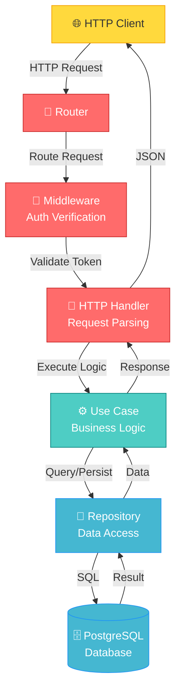

# Trello Clone Backend

A RESTful API backend for a Trello-like project management application built with Go. This project uses a clean architecture pattern with domain-driven design principles, PostgreSQL for data persistence, and JWT for authentication.

## 🏗️ Architecture

The project follows a clean architecture pattern with the following layers:

```
internal/
├── domain/          # Core business entities
├── usecase/         # Business logic layer
├── delivery/http/   # HTTP handlers and middleware
├── repository/      # Data access layer
└── infrastructure/  # Configuration and database setup
```

### Key Components

- **Domain**: Contains core entities (`User`, `Project`, `Task`)
- **Usecase**: Business logic for each feature (user, project, task operations)
- **Delivery**: HTTP handlers and middleware for request/response handling
- **Repository**: PostgreSQL implementations for data access
- **Infrastructure**: Database configuration and setup

### Clean Architecture Data Flow



## 🚀 Getting Started

### Prerequisites

- Go 1.26.1 or higher
- Docker and Docker Compose
- PostgreSQL 15+ (or use the included Docker setup)

### Installation

1. **Clone the repository**
```bash
git clone https://github.com/fablelie/trello-clone-backend.git
cd trello-clone-backend
```

2. **Install dependencies**
```bash
go mod download
```

3. **Set up environment variables**

Create a `.env` file in the root directory:
```env
DB_HOST=localhost
DB_USER=myuser
DB_PASSWORD=mypassword
DB_NAME=mydatabase
DB_PORT=5432
JWT_SECRET=your_secret_key_here
```

### Running the Application

#### Option 1: Using Docker Compose (Recommended)

```bash
docker-compose up -d
```

This will start:
- PostgreSQL database (port 5432)
- pgAdmin interface (port 5050)

Then run the application:
```bash
go run cmd/api/main.go
```

#### Option 2: Local Setup with Existing PostgreSQL

Ensure PostgreSQL is running, then:
```bash
go run cmd/api/main.go
```

The API will be available at `http://localhost:3000`

## 📋 API Endpoints

### Authentication

- `POST /api/auth/register` - Register a new user
- `POST /api/auth/login` - Login and receive JWT token

### Users

- `GET /api/users/:id` - Get user details
- `PUT /api/users/:id` - Update user profile
- `GET /api/users/:id/projects` - Get user's projects

### Projects

- `GET /api/projects` - List all projects for authenticated user
- `POST /api/projects` - Create a new project
- `GET /api/projects/:id` - Get project details
- `PUT /api/projects/:id` - Update project
- `DELETE /api/projects/:id` - Delete project

### Tasks

- `GET /api/projects/:projectId/tasks` - List tasks in a project
- `POST /api/projects/:projectId/tasks` - Create a task
- `GET /api/tasks/:id` - Get task details
- `PUT /api/tasks/:id` - Update task
- `DELETE /api/tasks/:id` - Delete task
- `PUT /api/tasks/:id/status` - Update task status

## 📊 Database Schema

### Entity Relationship Diagram

```
┌────────────────┐          ┌────────────────┐
│     USERS      │          │    PROJECTS    │
├────────────────┤          ├────────────────┤
│ PK  id         │◄─────────┼ FK  user_id    │  (Many Projects belong to One User)
│     email      │          │ PK  id         │
│     password   │          │     name       │
│     name       │          │     created_at │
└────────────────┘          └───────┬────────┘
                                    │
                                    │ 1
                                    │
                                    │ (One Project has Many Columns)
                                    │
                                    ▼ N
                            ┌────────────────┐
                            │    COLUMNS     │
                            ├────────────────┤
                            │ FK  project_id │
                            │ PK  id         │
                            │     name       │  (Status: Todo, Doing, Done)
                            │     color      │
                            │     order      │
                            └───────┬────────┘
                                    │
                                    │ 1
                                    │
                                    │ (One Column has Many Tasks)
                                    │
                                    ▼ N
                            ┌────────────────┐
                            │     TASKS      │
                            ├────────────────┤
                            │ FK  column_id  │
                            │ PK  id         │
                            │     subject    │
                            │     description│
                            │     created_at │
                            └────────────────┘
```

### Schema Description

- **USERS**: Stores user account information (id, email, password, name)
- **PROJECTS**: Represents projects owned by users with members and columns
- **COLUMNS**: Represents task status/stages in a project (Todo, Doing, Done) - similar to Kanban board columns
- **TASKS**: Contains tasks within columns, tracking subject, description, and assignment

## 🧪 Testing

Run the test suite:
```bash
go test ./...
```

Run tests with coverage:
```bash
go test -cover ./...
```

Run specific test files:
```bash
go test -run TestUserHandler ./internal/delivery/http/handler/
```

## 🔐 Authentication

The API uses JWT (JSON Web Tokens) for authentication. Include the token in the Authorization header:

```
Authorization: Bearer <your_jwt_token>
```

## 📦 Dependencies

Key dependencies:
- `gofiber/fiber/v3` - Web framework
- `gorm` - ORM for database operations
- `golang-jwt/jwt` - JWT token handling
- `crypto` - Password hashing and encryption

## 📄 Environment Variables

| Variable | Default | Description |
|----------|---------|-------------|
| DB_HOST | localhost | PostgreSQL host |
| DB_USER | myuser | PostgreSQL username |
| DB_PASSWORD | mypassword | PostgreSQL password |
| DB_NAME | mydatabase | Database name |
| DB_PORT | 5432 | PostgreSQL port |
| JWT_SECRET | secret_key | Secret key for JWT signing |

## 🛠️ Development

### Project Structure

```
trello-clone-backend/
├── cmd/api/main.go                    # Application entry point
├── internal/
│   ├── domain/                        # Core business entities
│   │   ├── user.go                    # User entity definition
│   │   ├── project.go                 # Project entity definition
│   │   └── task.go                    # Task entity definition
│   ├── usecase/                       # Business logic layer
│   │   ├── user_usecase.go            # User business logic
│   │   ├── project_usecase.go         # Project business logic
│   │   └── task_usecase.go            # Task business logic
│   ├── delivery/http/
│   │   ├── router.go                  # Route definitions
│   │   ├── handler/                   # HTTP request handlers
│   │   │   ├── user_handler.go
│   │   │   ├── project_handler.go
│   │   │   └── task_handler.go
│   │   └── middleware/                # HTTP middleware & auth
│   │       ├── auth_middleware.go
│   │       └── user_context.go
│   ├── repository/postgres/           # Data access layer
│   │   ├── schema.go                  # Database schema
│   │   ├── user_repo.go
│   │   ├── project_repo.go
│   │   └── task_repo.go
│   └── infrastructure/                # External services
│       ├── config/                    # Configuration
│       └── database/postgres.go       # DB initialization
├── docker-compose.yml                 # Docker services
├── go.mod                             # Go dependencies
└── README.md                          # This file
```

### Adding New Features

1. Define the domain model in `internal/domain/`
2. Create repository methods in `internal/repository/postgres/`
3. Implement business logic in `internal/usecase/`
4. Create HTTP handlers in `internal/delivery/http/handler/`
5. Register routes in `internal/delivery/http/router.go`
6. Add tests alongside implementation files

## 🐳 Docker

### Building the Docker Image

```bash
docker build -t trello-clone-backend .
```

### Running with Docker Compose

```bash
docker-compose up
```

Access pgAdmin at: `http://localhost:5050`
- Email: admin@admin.com
- Password: admin

## 📝 Postman Collection

A Postman collection is included (`Trello-clone-backend.postman_collection.json`) with pre-configured requests for all API endpoints.

Import it into Postman:
1. Open Postman
2. Click "Import"
3. Select `Trello-clone-backend.postman_collection.json`
4. Use the `Environment.postman_environment.json` for environment variables

## 📄 License

This project is licensed under the MIT License.

## 👤 Author

[fablelie](https://github.com/fablelie)